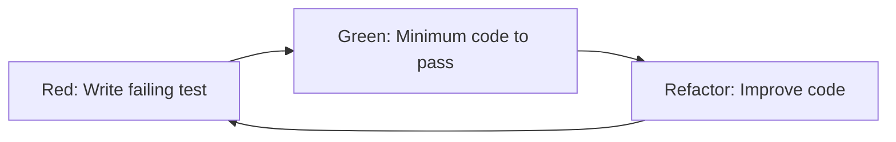

# Code Refactoring

## Purpose

Systematic guidance for improving code structure without changing external behavior. Applies Martin Fowler's refactoring catalog, TDD workflows, and modern TypeScript/React Native patterns to reduce technical debt and improve maintainability.

## When to Use This Skill

**Trigger scenarios:**
- Improving code structure or readability
- Reducing technical debt or code smells
- Preparing codebase for new features (preparatory refactoring)
- Modernizing legacy code
- Applying design patterns or SOLID principles
- Extracting components or custom hooks
- Improving type safety in TypeScript
- Migrating to feature-based architecture

**Keywords:** refactor, refactoring, code smell, technical debt, clean code, restructure, improve code quality, extract function, rename, simplify

---

## Core Principles

**Golden Rule:** Refactor without changing external behavior
- External tests should pass before and after
- User-visible functionality remains identical
- Internal structure improves for better maintainability

**Key Statistics (2025):**
- Developers spend **42%** of time dealing with technical debt
- Regular refactoring yields **15% performance improvement**
- Proper refactoring reduces bug risk and accelerates feature development

---

## When to Refactor (Priority Order)

### 1. **Before Adding New Features** ⭐⭐⭐ (Highest Priority)
Preparatory refactoring creates stable foundation for new development.

**Example:**
```typescript
// Before adding payment feature, refactor messy service layer
// Old: All logic in component (200 lines)
// New: Extracted service + hook (50 lines component, clean separation)
```

### 2. **When Code Smells Detected** ⭐⭐⭐
Common code smells requiring immediate attention:
- **Duplicated code** - Same logic repeated in multiple places
- **Long functions** - Methods exceeding 50 lines
- **Long parameter lists** - More than 5 parameters
- **Large classes** - Classes exceeding 250 lines
- **Nested conditionals** - 3+ levels of nesting
- **Dead code** - Unused functions or variables

### 3. **After Feature Completion** ⭐⭐
Clean up implementation details, optimize performance.

### 4. **During Technology Migration** ⭐⭐
Framework upgrades, library changes, architecture evolution.

### 5. **For Team Onboarding** ⭐
Improve readability for new team members.

---

## Core Best Practices (Top 7)

### 1. **Test First, Refactor Second**
Always have test coverage before refactoring. If tests don't exist, write them first.

```typescript
// 1. Write tests for existing behavior
test('should format donation amount', () => {
  expect(formatAmount(1000)).toBe('₩1,000');
});

// 2. Refactor implementation
// 3. Tests still pass → Safe refactoring
```

### 2. **Small Steps with Frequent Commits** 🔥 Most Important
```
✅ CORRECT: 10-50 lines per commit
❌ WRONG: 500 lines in one commit

Workflow:
Small change → Test → Commit → Repeat
```

### 3. **Separate Refactoring from Feature Work**
```
❌ WRONG: Refactoring + New Feature + Bug Fix (same PR)
✅ CORRECT: Each in separate PR

Example commits:
- "refactor: Extract DonateButton component"
- "feat: Add payment confirmation dialog"
- "fix: Handle payment cancellation"
```

### 4. **Collaborate with QA Team**
- Automated tests (Jest, React Testing Library)
- Code review process
- Regression testing

### 5. **Use Automation Tools**
- **IDE features**: VS Code refactoring commands (F2 rename, Extract function)
- **Linters**: ESLint, TypeScript compiler
- **Static analysis**: SonarQube, CodeClimate
- **AI tools**: GitHub Copilot, Refact.ai

### 6. **Eliminate Code Duplication First**
Duplicated code multiplies maintenance cost. Use DRY (Don't Repeat Yourself) principle.

### 7. **Version Control Every Step**
Each refactoring step should be a separate commit with clear message:
```bash
git commit -m "refactor: Extract formatDonation utility function"
git commit -m "refactor: Rename user to authenticatedUser for clarity"
```

---

## Refactoring Workflows

### Red-Green-Refactor (TDD-Based) ⭐ Recommended



**Steps:**
1. **Red** - Write test that fails (feature doesn't exist yet)
2. **Green** - Write minimum code to make test pass
3. **Refactor** - Improve code structure while keeping tests green

**Example:**
```typescript
// 1. Red - Test fails
test('should calculate total donations', () => {
  expect(calculateTotal([1000, 2000, 3000])).toBe(6000);
});

// 2. Green - Simple implementation
function calculateTotal(amounts: number[]) {
  let sum = 0;
  for (let i = 0; i < amounts.length; i++) {
    sum += amounts[i];
  }
  return sum;
}

// 3. Refactor - Cleaner implementation
function calculateTotal(amounts: number[]): number {
  return amounts.reduce((sum, amount) => sum + amount, 0);
}
```

### Incremental Refactoring Strategy

```
Phase 1: Analyze Current State
├─ Measure code complexity (cyclomatic complexity)
├─ Check test coverage
└─ Set refactoring goals

Phase 2: Build Safety Net
├─ Write tests for existing behavior
├─ Commit current state
└─ Create feature branch

Phase 3: Execute in Small Steps
├─ Apply one technique at a time
├─ Run tests after each change
├─ Commit after successful change
└─ Repeat

Phase 4: Validate & Integrate
├─ Run full test suite
├─ Code review
└─ Merge to main branch
```

---

## Common Refactoring Techniques

**Note:** This is a curated subset. See [references/martin-fowler-catalog.md](references/martin-fowler-catalog.md) for complete catalog.

### Basic Techniques (Most Used)

| Technique | When to Use | Example |
|-----------|-------------|---------|
| **Extract Function** | Function exceeds 50 lines | Split long function into smaller, named functions |
| **Inline Function** | Function is trivial (1-2 lines, used once) | Remove unnecessary abstraction |
| **Extract Variable** | Complex expression needs clarity | `const isValidDonation = amount >= 1000 && amount <= 1000000` |
| **Rename** | Name doesn't reflect purpose | `data` → `authenticatedUser` |

### Encapsulation Techniques

| Technique | When to Use |
|-----------|-------------|
| **Encapsulate Variable** | Global variable needs control |
| **Encapsulate Collection** | Direct array/object access should be prevented |
| **Hide Delegate** | Dependency chain is too long |

### Data Structure Improvements

| Technique | When to Use |
|-----------|-------------|
| **Replace Primitive with Object** | Primitive type gains behavior |
| **Replace Array with Object** | Array indices lack meaning |
| **Change Value to Reference** | Same object used in multiple places |

### Conditional Simplification

| Technique | When to Use |
|-----------|-------------|
| **Decompose Conditional** | Complex if/else needs clarity |
| **Replace Conditional with Polymorphism** | Type-based behavior switching |
| **Introduce Guard Clauses** | Early returns for special cases |

**Example - Guard Clauses:**
```typescript
// ❌ Before: Nested conditionals
function processPayment(amount: number, user: User) {
  if (amount > 0) {
    if (user) {
      if (user.isVerified) {
        // Process payment
      }
    }
  }
}

// ✅ After: Guard clauses
function processPayment(amount: number, user: User) {
  if (amount <= 0) return;
  if (!user) return;
  if (!user.isVerified) return;

  // Process payment (main logic at lowest nesting level)
}
```

### Hierarchy Management

| Technique | When to Use |
|-----------|-------------|
| **Pull Up Method** | Duplicate methods in multiple subclasses |
| **Push Down Method** | Method only used by some subclasses |
| **Extract Superclass** | Common functionality across classes |

---

## React Native / TypeScript Patterns

**Note:** See [references/react-native-patterns.md](references/react-native-patterns.md) for comprehensive examples.

### 1. Component Extraction

```typescript
// ❌ Before: Monolithic screen (500 lines)
function MainScreen() {
  // Header logic (50 lines)
  // Donation button logic (100 lines)
  // Leaderboard logic (200 lines)
  // Footer logic (50 lines)
}

// ✅ After: Extracted components
function MainScreen() {
  return (
    <>
      <MainHeader />
      <DonateButton />
      <LeaderboardSection />
      <MainFooter />
    </>
  );
}
```

### 2. Custom Hook Extraction

```typescript
// ❌ Before: Component with complex logic
function DonateButton() {
  const [status, setStatus] = useState('idle');
  // 100 lines of payment logic
}

// ✅ After: Custom hook
function useDonationPayment() {
  const [status, setStatus] = useState('idle');
  // Payment logic here
  return { status, processDonation };
}

function DonateButton() {
  const { status, processDonation } = useDonationPayment();
  return <Button onPress={processDonation}>기부하기</Button>;
}
```

### 3. Type Safety Enhancement

```typescript
// ❌ Before: any types
function fetchLeaderboard(params: any): Promise<any> {
  return api.get('/leaderboard', params);
}

// ✅ After: Explicit types
interface LeaderboardParams {
  limit: number;
  sortBy: 'total_donated' | 'last_donation_at';
}

interface LeaderboardEntry {
  rank: number;
  nickname: string;
  total_donated: number;
}

function fetchLeaderboard(
  params: LeaderboardParams
): Promise<LeaderboardEntry[]> {
  return api.get('/leaderboard', params);
}
```

### 4. Service Layer Extraction

```typescript
// ❌ Before: Direct API calls in components
function MainScreen() {
  const fetchData = async () => {
    const { data } = await supabase
      .from('leaderboard')
      .select('*')
      .order('total_donated', { ascending: false });
    setLeaderboard(data);
  };
}

// ✅ After: Service layer
// src/services/leaderboardService.ts
export const leaderboardService = {
  async getTopRankers(limit: number) {
    const { data, error } = await supabase
      .from('leaderboard')
      .select('*')
      .order('total_donated', { ascending: false })
      .limit(limit);

    if (error) throw error;
    return data;
  }
};

// Component uses service
function MainScreen() {
  const { data } = useQuery({
    queryKey: ['topRankers'],
    queryFn: () => leaderboardService.getTopRankers(10)
  });
}
```

---

## Anti-Patterns to Avoid

### 1. **Changing Too Much at Once**
```
❌ WRONG: 500-line refactoring + new feature + bug fix
✅ CORRECT: Separate PRs for each concern
```

### 2. **Refactoring Without Tests**
```
❌ WRONG: "It works, so it's fine"
✅ CORRECT: Automated tests verify behavior
```

### 3. **Over-Abstraction**
```
❌ WRONG: Abstract class + interface for 2 uses
✅ CORRECT: Wait for 3rd use (Rule of Three)
```

### 4. **Meaningless Renaming**
```
❌ WRONG: data → info (no improvement)
✅ CORRECT: user → authenticatedUser (clearer purpose)
```

### 5. **Adding Features During Refactoring**
```
❌ WRONG: "While I'm here, let me add..."
✅ CORRECT: Finish refactoring first, then add features
```

---

## Quality Metrics

### Quantitative Goals

| Metric | Target |
|--------|--------|
| **Cyclomatic Complexity** | ≤10 per function |
| **Function Length** | ≤50 lines |
| **File Size** | ≤250 lines |
| **Test Coverage** | ≥80% |
| **Code Duplication** | ≤5% |

### Qualitative Indicators

- ✅ New team members understand code faster
- ✅ Bug fix time decreases
- ✅ Feature development accelerates
- ✅ Code review time reduces

---

## Tools & Automation

### VS Code Extensions
- **ESLint** - Code quality checks
- **Prettier** - Auto-formatting
- **SonarLint** - Real-time analysis
- **GitHub Copilot** - AI refactoring suggestions

### CLI Tools
```bash
# Complexity analysis
npm install -g complexity-report
cr src/**/*.ts

# Duplicate code detection
npm install -g jscpd
jscpd src/

# Unused dependencies
npm install -g depcheck
depcheck
```

### React Native Specific
```bash
# Bundle size analysis
npx react-native-bundle-visualizer

# Performance profiling
npx react-native profile-hermes
```

---

## Checklist

### Before Refactoring
- [ ] Define clear refactoring goal
- [ ] Existing tests pass (or write tests first)
- [ ] Create feature branch
- [ ] Commit current state

### During Refactoring
- [ ] Apply one technique at a time
- [ ] Test after each change
- [ ] Commit in small units (10-50 lines)
- [ ] Use descriptive commit messages

### After Refactoring
- [ ] Full test suite passes
- [ ] Build succeeds (`npm run type-check`)
- [ ] Code review requested
- [ ] Documentation updated (if needed)
- [ ] PR created and merged

---

## Resources

### Bundled References

- **[references/martin-fowler-catalog.md](references/martin-fowler-catalog.md)** - Complete refactoring catalog with detailed examples
- **[references/react-native-patterns.md](references/react-native-patterns.md)** - React Native/TypeScript-specific refactoring patterns
- **[references/best-practices-detailed.md](references/best-practices-detailed.md)** - In-depth best practices with case studies
- **[references/anti-patterns.md](references/anti-patterns.md)** - Common mistakes and how to avoid them

### External Resources

- **Martin Fowler's Refactoring Catalog**: https://refactoring.com/catalog/
- **Refactoring.Guru**: https://refactoring.guru/refactoring
- **TypeScript Best Practices 2025**: https://dev.to/sovannaro/typescript-best-practices-2025

---

**Skill Version:** 1.0.0
**Last Updated:** 2025-11-04
**Research Date:** 2025-11-04
