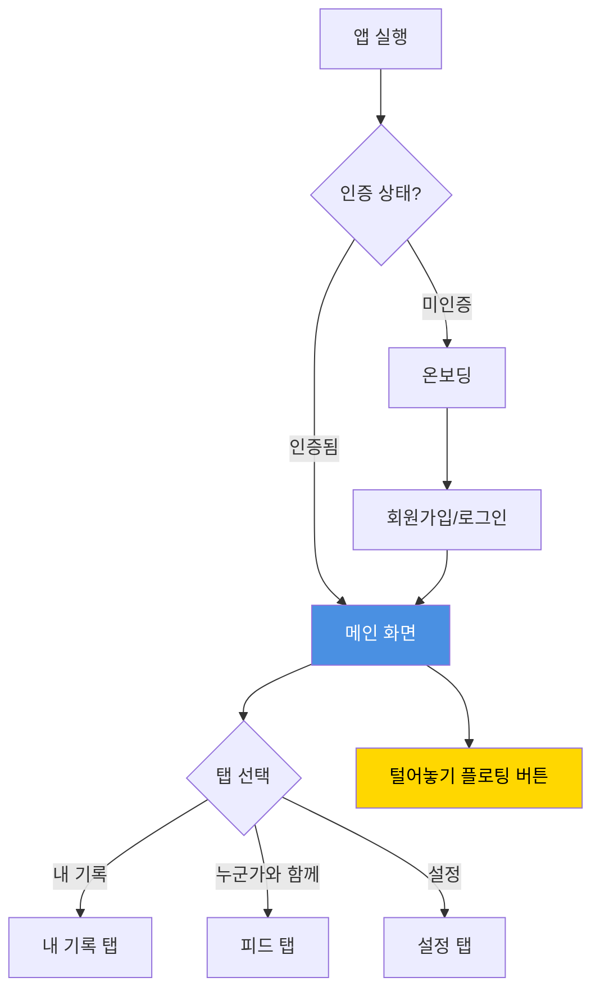
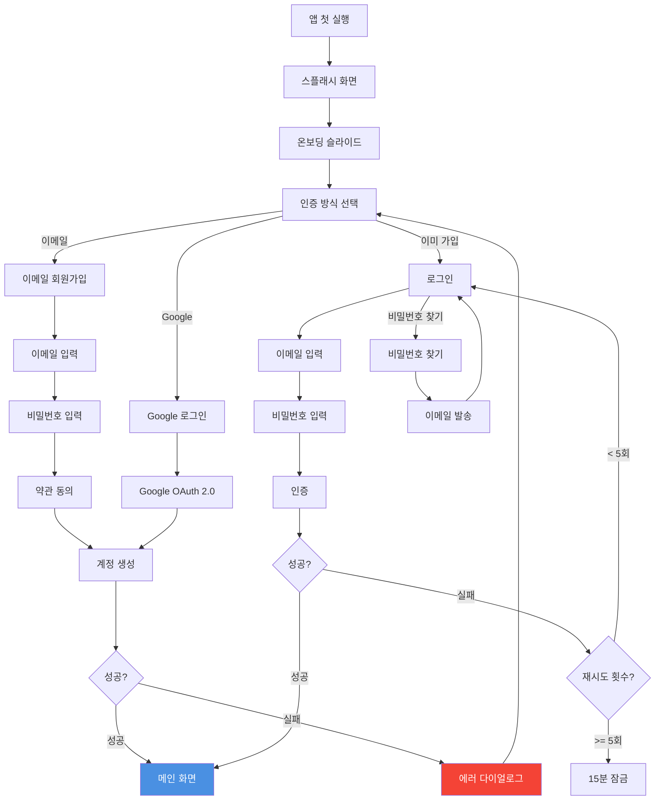
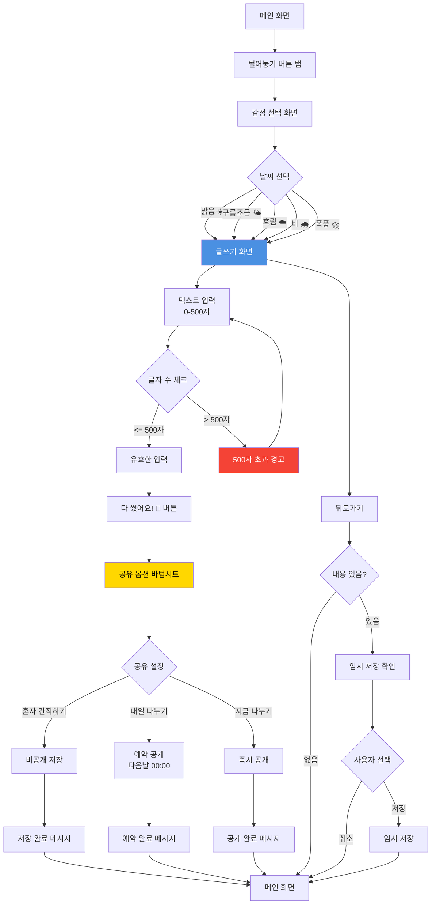
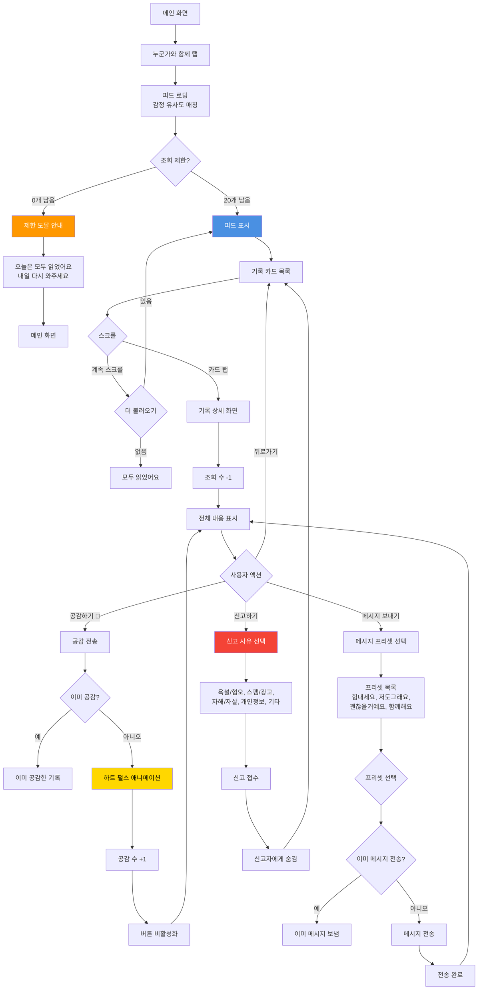
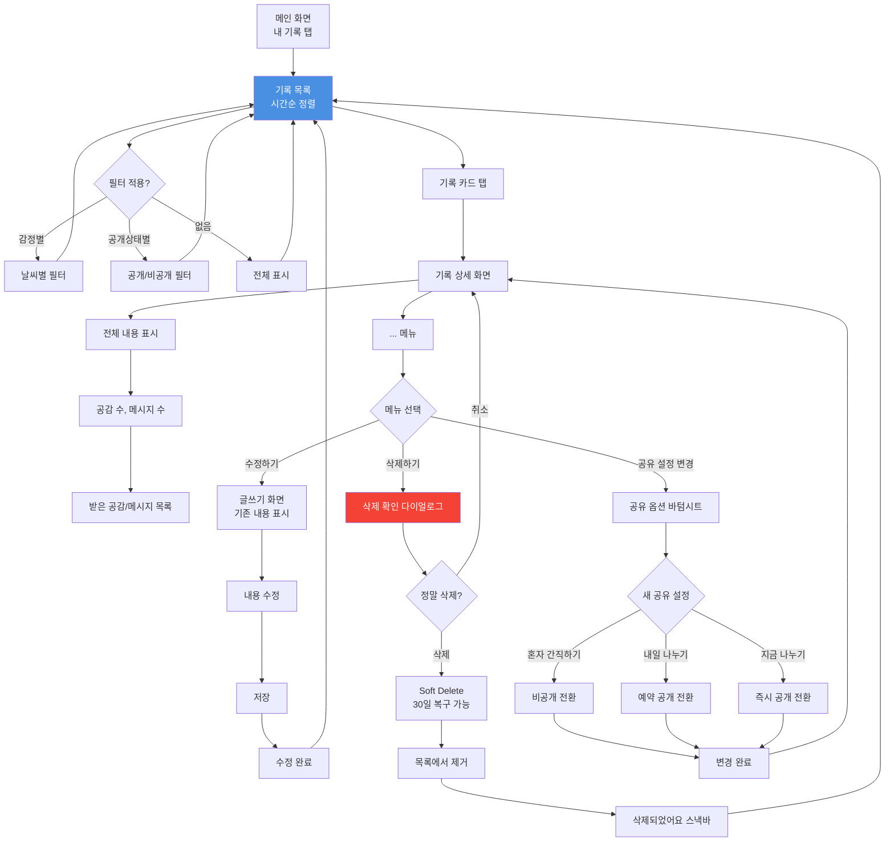
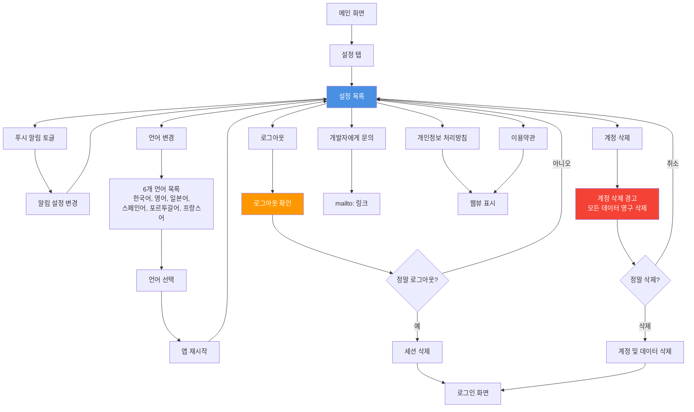

# 화면 Flow 다이어그램

**프로젝트**: Hang On
**버전**: 1.0.0
**최종 업데이트**: 2025-11-09

---

## 목차

1. [전체 앱 구조](#전체-앱-구조)
2. [인증 Flow](#인증-flow)
3. [털어놓기 Flow](#털어놓기-flow)
4. [누군가와 함께 Flow](#누군가와-함께-flow)
5. [내 기록 관리 Flow](#내-기록-관리-flow)
6. [설정 Flow](#설정-flow)
7. [화면 목록](#화면-목록)

---

## 전체 앱 구조

---

## 인증 Flow

### 회원가입 및 로그인

---

## 털어놓기 Flow

### 감정 기록 작성

---

## 누군가와 함께 Flow

### 피드 조회 및 공감

---

## 내 기록 관리 Flow

### 조회, 수정, 삭제

---

## 설정 Flow

### 계정 및 앱 설정

---

## 화면 목록

### 인증 관련

| 화면명             | 타입   | 설명                 | 우선순위 |
| ------------------ | ------ | -------------------- | -------- |
| 스플래시 화면      | Screen | 앱 로딩 (< 3초)      | P0       |
| 온보딩 슬라이드    | Screen | 3-4개 슬라이드 소개  | P1       |
| 회원가입 화면      | Screen | 이메일/Google 선택   | P0       |
| 로그인 화면        | Screen | 이메일/비밀번호 입력 | P0       |
| 비밀번호 찾기 화면 | Screen | 이메일 발송          | P0       |

### 메인 기능

| 화면명              | 타입         | 설명                    | 우선순위 |
| ------------------- | ------------ | ----------------------- | -------- |
| 메인 화면 (내 기록) | Screen       | 탭바 + 기록 목록        | P0       |
| 누군가와 함께 탭    | Screen       | 피드 목록               | P0       |
| 설정 탭             | Screen       | 계정/앱 설정            | P0       |
| 감정 선택 화면      | Screen       | 5단계 날씨 선택         | P0       |
| 글쓰기 화면         | Screen       | 텍스트 입력 (500자)     | P0       |
| 공유 옵션 바텀시트  | Bottom Sheet | 3가지 옵션 선택         | P0       |
| 기록 상세 화면      | Screen       | 전체 내용 + 공감/메시지 | P0       |
| 메시지 프리셋 선택  | Bottom Sheet | 4개 프리셋              | P0       |

### 다이얼로그

| 화면명               | 타입   | 설명             | 우선순위 |
| -------------------- | ------ | ---------------- | -------- |
| 삭제 확인 다이얼로그 | Dialog | 기록 삭제 확인   | P0       |
| 신고 다이얼로그      | Dialog | 신고 사유 선택   | P0       |
| 임시 저장 확인       | Dialog | 뒤로가기 시      | P0       |
| 공유 설정 변경 확인  | Dialog | 공개/비공개 전환 | P0       |
| 로그아웃 확인        | Dialog | 로그아웃 확인    | P0       |
| 계정 삭제 경고       | Dialog | 데이터 삭제 경고 | P0       |

### Empty/Error 상태

| 화면명                | 타입  | 설명                     | 우선순위 |
| --------------------- | ----- | ------------------------ | -------- |
| Empty State (내 기록) | State | "아직 기록이 없어요"     | P0       |
| Empty State (피드)    | State | "도착한 이야기가 없어요" | P0       |
| 조회 제한 도달        | State | "오늘은 모두 읽었어요"   | P0       |
| 네트워크 에러         | State | 연결 실패 안내           | P0       |
| 서버 에러 (500)       | State | 일시적 오류 안내         | P0       |

---

## Flow 설계 원칙

### 1. Happy Path 우선

- 가장 일반적인 사용자 여정을 먼저 설계
- 대체 경로(에러, 취소)는 나중에 추가

### 2. 최소 클릭 수

- 주요 기능은 3클릭 이내 도달
- 예: 메인 → 털어놓기 → 감정 선택 → 글쓰기 → 공유 (3단계)

### 3. 명확한 피드백

- 모든 액션에 즉각적인 피드백 제공
- 예: 공감 전송 → 하트 애니메이션 → 버튼 비활성화

### 4. 되돌리기 가능

- 파괴적 액션(삭제)은 확인 다이얼로그 필수
- Soft Delete로 복구 가능 기간 제공 (30일)

### 5. 일관된 네비게이션

- 뒤로가기 버튼 위치 고정 (좌상단)
- 하단 탭바 위치 고정
- 플로팅 버튼 위치 고정 (우하단)

---

## 다음 단계

1. ✅ 사용자 시나리오 작성 완료 (`docs/USER_SCENARIOS.md`)
2. ✅ 화면 Flow 다이어그램 완료 (현재 문서)
3. ⏳ 주요 화면 레이아웃 스케치 (`docs/LAYOUT_SKETCHES.md`)
4. ⏳ 디자인 시스템 문서 작성 (`docs/DESIGN_SYSTEM.md`)
5. ⏳ 디자인 시스템 코드 작성 (`src/theme/`)

---

**문서 버전**: 1.0.0
**최종 업데이트**: 2025-11-09
**다음 리뷰**: 레이아웃 스케치 완료 후
